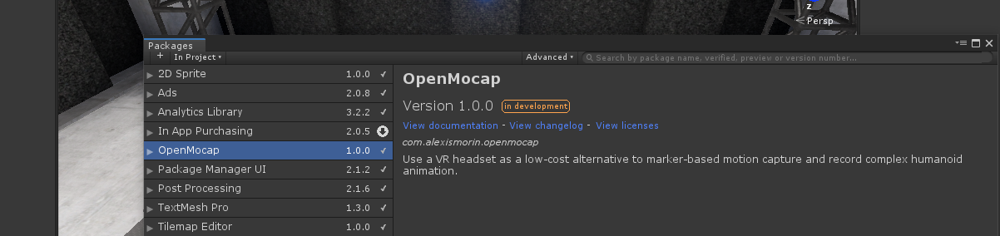

With this Unity package, there is now a low-cost alternative to professional Motion Capture! Simply plug in your trusty HMD and motion controllers, jump into the virtual Mocap studio and start wiggling around - The plugin will harvest positional data at runtime from your VR device and automatically animate a humanoid character. The plugin will, match your actual head and arm movements, and generate IK leg, arm, knees and feet animation accordingly! 

Obviously it's not perfect, but it's a great place to start for iterative animation work if you need complex humanoid animations for game cutscenes or real-time video. After recording your takes with the Unity Recorder, a viable workflow would be to send your animation into Maya or Blender with the [FBX Exporter](https://blogs.unity3d.com/2018/11/13/fbx-exporter-and-round-tripping-between-autodesk-3ds-max-autodesk-maya-and-unity/) to tweak them, as you would with other animations recorded from inside the engine.

### Dependencies & Requirements
- Unity 2019.1 or later suggested
- Have "Virtual Reality Supported" enabled in your XR Settings for that Unity Project.
- Package Manager Version of the Unity Recorder
- A VR headset with motion controllers (Tested on Oculus Rift CV1, ought to work with the HTC Vive + Wands and maybe with WMR headsets)

### Install process

Unlike most of my other packages, this repo does not only contain a package but also a sample project. While you can install the package onto any other Unity project, you can open the correctly configured sample project to check things out first - if you're then happy follow the instructions below.

This is a plugin that makes use of Unity's new *Package Manager* feature. Just drop the *com.alexismorin.openmocap* folder into your *packages* folder (found at the same level as the Assets folder) and it should work out-of-the-box. If you're using an older version of Unity (not really supported here, but can be made to work if you're courageous), take the *com.alexismorin.openmocap* folder and then drag it anywhere into your regular project hierarchy.

### TODO
- Hand motion (fists, fingers, etc).
- Add some recording code from my Virtual Filmback package so that you can start and stop recordings from inside the studio itself.
- Record volume and pitch data from HMD microphone to use for facial animation.
- Record audio tracks from HMD microphone for scratch audio takes.
- Simple blinking/expression data system inferred from audio.
- More robust XR multiplatform support.

Per usual, this was spat out in around... 5 to 6 hours? Expect it to be pretty buggy.
